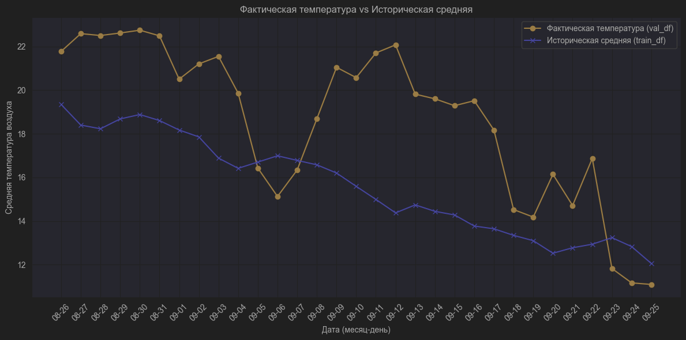

Из-за этого может быть сложность предсказывать

Вообще без признаков, только с индексом

|    | model        |       MAE |        MSE |     RMSE |       MAPE |          R2 |
|---:|:-------------|----------:|-----------:|---------:|-----------:|------------:|
|  0 | HistGB       | 11.670542 | 149.394787 | 12.222716 | 61.000251 | -10.338657 |
|  1 | LightGBM     | 11.706661 | 150.147069 | 12.253451 | 61.150585 | -10.395753 |
|  2 | XGBoost      | 11.709210 | 150.267370 | 12.258359 | 61.208744 | -10.404884 |
|  3 | CatBoost     | 11.710028 | 150.231695 | 12.256904 | 61.168987 | -10.402176 |
|  4 | RandomForest | 11.711170 | 150.352163 | 12.261817 | 61.225676 | -10.411319 |

## Run at 2026-04-09 18:27:59
Разобранная дата

|    | model        |     MAE |      MSE |    RMSE |    MAPE |         R2 |
|---:|:-------------|--------:|---------:|--------:|--------:|-----------:|
|  0 | CatBoost     | 2.60525 |  9.54182 | 3.08898 | 14.0587 |  0.275802  |
|  1 | RandomForest | 2.63509 |  9.56149 | 3.09217 | 15.2257 |  0.274309  |
|  2 | LightGBM     | 2.71289 | 11.0041  | 3.31724 | 14.6018 |  0.164822  |
|  3 | XGBoost      | 2.8598  | 12.1444  | 3.48488 | 15.1718 |  0.0782721 |
|  4 | HistGB       | 5.02905 | 39.5585  | 6.28956 | 26.9826 | -2.00239   |
Первые 3 MAE: 7.94

## Run at 2026-04-09 18:50:42
Синус и косинус дня

|    | model        |     MAE |     MSE |    RMSE |    MAPE |          R2 |
|---:|:-------------|--------:|--------:|--------:|--------:|------------:|
|  0 | CatBoost     | 3.00255 | 12.5372 | 3.54079 | 15.7383 |  0.0484594  |
|  1 | XGBoost      | 3.08695 | 13.2561 | 3.6409  | 16.3601 | -0.00610419 |
|  2 | LightGBM     | 3.3388  | 15.2524 | 3.90544 | 17.4765 | -0.157619   |
|  3 | HistGB       | 3.38817 | 16.6791 | 4.084   | 18.5059 | -0.265895   |
|  4 | RandomForest | 3.40892 | 15.6636 | 3.95773 | 17.5248 | -0.188825   |
Первые 3 MAE: 9.428304054066995

## Run at 2026-04-09 18:51:28
Сезон

|    | model        |     MAE |     MSE |    RMSE |    MAPE |         R2 |
|---:|:-------------|--------:|--------:|--------:|--------:|-----------:|
|  0 | CatBoost     | 2.98557 | 12.5557 | 3.54341 | 15.6971 |  0.0470548 |
|  1 | LightGBM     | 3.23083 | 14.0652 | 3.75037 | 16.9787 | -0.0675136 |
|  2 | XGBoost      | 3.26612 | 14.501  | 3.80801 | 17.0515 | -0.100584  |
|  3 | RandomForest | 3.40715 | 15.6601 | 3.95728 | 17.5682 | -0.188558  |
|  4 | HistGB       | 3.75485 | 19.5545 | 4.42204 | 20.4192 | -0.48413   |
Первые 3 MAE: 9.482521600040677

## Run at 2026-04-09 18:55:43
Косинусный + Синусный месяц

|    | model        |     MAE |     MSE |    RMSE |    MAPE |          R2 |
|---:|:-------------|--------:|--------:|--------:|--------:|------------:|
|  0 | CatBoost     | 2.99459 | 12.4219 | 3.52448 | 15.7659 |  0.0572096  |
|  1 | LightGBM     | 3.13363 | 13.2097 | 3.63452 | 16.5383 | -0.00258132 |
|  2 | RandomForest | 3.41758 | 15.6471 | 3.95564 | 17.6369 | -0.187572   |
|  3 | XGBoost      | 3.51813 | 16.9918 | 4.12211 | 18.4655 | -0.28963    |
|  4 | HistGB       | 3.73242 | 20.3317 | 4.50907 | 20.2398 | -0.543124   |
Первые 3 MAE: 9.54580042149722

## Run at 2026-04-09 19:35:06
Среднее значение температуры

|    | model        |     MAE |     MSE |    RMSE |    MAPE |         R2 |
|---:|:-------------|--------:|--------:|--------:|--------:|-----------:|
|  0 | CatBoost     | 3.25162 | 14.3705 | 3.79085 | 17.1065 | -0.0906836 |
|  1 | LightGBM     | 3.42855 | 16.3816 | 4.04742 | 17.9028 | -0.243322  |
|  2 | HistGB       | 3.53526 | 18.8333 | 4.33974 | 19.1804 | -0.429399  |
|  3 | RandomForest | 3.54648 | 17.3278 | 4.16267 | 18.8118 | -0.315136  |
|  4 | XGBoost      | 3.63255 | 19.308  | 4.39409 | 19.4125 | -0.465426  |
Первые 3 MAE: 10.215429266495153

## Run at 2026-04-09 19:38:49
Среднее значение всех признаков

|    | model        |     MAE |     MSE |    RMSE |    MAPE |          R2 |
|---:|:-------------|--------:|--------:|--------:|--------:|------------:|
|  0 | CatBoost     | 3.08665 | 13.0658 | 3.61466 | 16.3522 |  0.00834132 |
|  1 | XGBoost      | 3.55011 | 18.7204 | 4.32671 | 19.1244 | -0.42083    |
|  2 | RandomForest | 3.62744 | 18.5434 | 4.30621 | 19.178  | -0.407394   |
|  3 | LightGBM     | 3.64143 | 18.4953 | 4.30062 | 19.2198 | -0.403746   |
|  4 | HistGB       | 3.7403  | 21.3931 | 4.62527 | 20.8592 | -0.62368    |
Первые 3 MAE: 10.264193590587562

## Run at 2026-04-09 20:06:05
Добавление признака разницы этого ВМО от среднего

|    | model        |     MAE |     MSE |    RMSE |    MAPE |        R2 |
|---:|:-------------|--------:|--------:|--------:|--------:|----------:|
|  0 | CatBoost     | 3.1975  | 13.7555 | 3.70884 | 17.0633 | -0.044004 |
|  1 | LightGBM     | 3.44576 | 16.5831 | 4.07224 | 18.1274 | -0.258614 |
|  2 | RandomForest | 3.56764 | 17.6631 | 4.20274 | 18.9044 | -0.340577 |
|  3 | XGBoost      | 3.61254 | 18.8393 | 4.34042 | 19.0369 | -0.429849 |
|  4 | HistGB       | 3.69614 | 20.3696 | 4.51327 | 20.34   | -0.545998 |
Первые 3 MAE: 10.210900068461445

## Run at 2026-04-09 20:09:49
Удаление некоторых выбросов

|    | model        |     MAE |     MSE |    RMSE |    MAPE |         R2 |
|---:|:-------------|--------:|--------:|--------:|--------:|-----------:|
|  0 | CatBoost     | 3.04037 | 12.5024 | 3.53587 | 16.3453 |  0.0511013 |
|  1 | LightGBM     | 3.39519 | 15.8362 | 3.97948 | 17.8913 | -0.201928  |
|  2 | HistGB       | 3.41341 | 16.9858 | 4.12138 | 18.8758 | -0.289176  |
|  3 | XGBoost      | 3.55992 | 18.6804 | 4.32209 | 19.0659 | -0.417795  |
|  4 | RandomForest | 3.57657 | 17.757  | 4.21391 | 18.9745 | -0.347711  |
Первые 3 MAE: 9.848970454583014

## Run at 2026-04-21 17:46:53
Добавление лагов, что было год назад +- 1 месяц

|    | model        |     MAE |     MSE |    RMSE |    MAPE |         R2 |
|---:|:-------------|--------:|--------:|--------:|--------:|-----------:|
|  0 | CatBoost     | 3.03541 | 12.7079 | 3.56482 | 16.1149 |  0.0355035 |
|  1 | XGBoost      | 3.23277 | 15.3983 | 3.92406 | 16.9854 | -0.168688  |
|  2 | HistGB       | 3.2444  | 16.2028 | 4.02528 | 17.3169 | -0.229752  |
|  3 | LightGBM     | 3.37679 | 15.7248 | 3.96545 | 17.8376 | -0.19347   |
|  4 | RandomForest | 3.48208 | 17.0682 | 4.13137 | 18.4036 | -0.295433  |
Первые 3 MAE: 9.512573991439961

## Run at 2026-04-26 12:58:37
Вместо полного удаления выбросов, ограничиваем их (Только для temp_delta_vs_all_stations)

|    | model        |     MAE |     MSE |    RMSE |    MAPE |         R2 |
|---:|:-------------|--------:|--------:|--------:|--------:|-----------:|
|  0 | CatBoost     | 2.97856 | 12.1937 | 3.49195 | 15.927  |  0.0745286 |
|  1 | HistGB       | 3.31385 | 15.9959 | 3.99949 | 17.3037 | -0.214045  |
|  2 | XGBoost      | 3.34653 | 16.0841 | 4.0105  | 17.8155 | -0.220738  |
|  3 | LightGBM     | 3.37154 | 15.778  | 3.97215 | 17.8173 | -0.197506  |
|  4 | RandomForest | 3.47735 | 16.9929 | 4.12225 | 18.3925 | -0.289717  |
Первые 3 MAE: 9.63894549560711

## Run at 2026-04-26 14:19:16
Обработка всех выбросов

|    | model        |     MAE |     MSE |    RMSE |    MAPE |          R2 |
|---:|:-------------|--------:|--------:|--------:|--------:|------------:|
|  0 | CatBoost     | 3.05762 | 13.2572 | 3.64105 | 16.3075 | -0.00618695 |
|  1 | LightGBM     | 3.09813 | 13.5071 | 3.6752  | 16.3835 | -0.0251493  |
|  2 | XGBoost      | 3.50306 | 18.4137 | 4.29111 | 18.4498 | -0.397546   |
|  3 | RandomForest | 3.51951 | 17.4433 | 4.17651 | 18.6214 | -0.323896   |
|  4 | HistGB       | 3.58045 | 19.763  | 4.44556 | 18.589  | -0.49996    |
Первые 3 MAE: 9.658803735996198

## Run at 2026-04-26 14:24:01
Учитываем больше выбросов

|    | model        |     MAE |     MSE |    RMSE |    MAPE |         R2 |
|---:|:-------------|--------:|--------:|--------:|--------:|-----------:|
|  0 | CatBoost     | 2.99065 | 12.716  | 3.56595 | 16.0509 |  0.0348894 |
|  1 | HistGB       | 3.23952 | 16.3816 | 4.04742 | 17.1333 | -0.24332   |
|  2 | XGBoost      | 3.28445 | 15.9165 | 3.98954 | 17.4159 | -0.208016  |
|  3 | LightGBM     | 3.30335 | 15.0746 | 3.88261 | 17.4432 | -0.144124  |
|  4 | RandomForest | 3.4822  | 16.9631 | 4.11863 | 18.4397 | -0.287452  |
Первые 3 MAE: 9.514612312992515

## Run at 2026-04-26 14:27:48
Обработка только одного столбца с выбросами

|    | model        |     MAE |     MSE |    RMSE |    MAPE |         R2 |
|---:|:-------------|--------:|--------:|--------:|--------:|-----------:|
|  0 | CatBoost     | 2.97856 | 12.1937 | 3.49195 | 15.927  |  0.0745286 |
|  1 | HistGB       | 3.31385 | 15.9959 | 3.99949 | 17.3037 | -0.214045  |
|  2 | XGBoost      | 3.34653 | 16.0841 | 4.0105  | 17.8155 | -0.220738  |
|  3 | LightGBM     | 3.37154 | 15.778  | 3.97215 | 17.8173 | -0.197506  |
|  4 | RandomForest | 3.47735 | 16.9929 | 4.12225 | 18.3925 | -0.289717  |
Первые 3 MAE: 9.63894549560711

